# Exercises for the Data Science Course Developer role

I did all the 7 tasks and wrote down the time I took for doing each of them at the bottom of my answers. Also, being a Python-oriented developer, I didn't have much prior knowledge of the R programming language so I took around 2h to go over the documentation and a few videos to get familiar with it.

# Task 1, question 1

Hi,
Thank you for your question. Indeed, it is probably a write permissions issue. I suggest you try the following steps:
1.	Open your file explorer and locate your "C:/Program Files/R/R-3.5.1/library" folder
2.	Right click on it and open the “Properties” panel.
3.	Open the security tab. There you can see the different users and groups in the upper part “Group or user names” and the allowed permissions “Permissions for SYSTEM” in the lower part.
4.	Choose your user/group name and check whether the “Write” permission is allowed or denied. Click on the “Edit” button.
5.	 Try checking the box to allow the Write permission or, if the Denied box is checked for the Write permission, try unchecking it.

If you encounter any issue while doing these steps, then do not hesitate to write me back. I’ll be happy to help you. It is also possible that the company didn’t give you the correct rights on that PC and, in that case, you should contact your IT division to let them know.
Good luck!

Comment: if the student is on Linux or Mac then I would send them the commands they would have to execute. I'm using the three OSs Mac, Linux and Windows at home so I should be able to answer for all three situations.

**Time taken:** 5 minutes to find the answer + 10 min to write it.

# Task 1, question 2

Hi,

thank you for your question. I am sorry our explanations weren't clear enough. I should have focused more on the purpose of the `gather` function.

Often the data we have at disposal is not in the right "shape" for what we would like to do with it. Here is an example. Let's say you have the following data:

| country     | 1952 | 1957 | 1962 | 1967 | 1972 | 1977 | 1982 | 1987 | 1992 |
|-------------|------|------|------|------|------|------|------|------|------|
| France      | 10   | 10   | 5    | 5    | 8    | 8    | 8    | 9    | 9    |
| Georgia     | -9   | -7   | -7   | -7   | -7   | -7   | -7   | -7   | 4    |
| Germany     | 10   | 10   | 10   | 10   | 10   | 10   | 10   | 10   | 10   |
| Greece      | 4    | 4    | 4    | -7   | -7   | 8    | 8    | 10   | 10   |
| Guatemala   | 2    | -6   | -5   | 3    | 1    | -3   | -7   | 3    | 3    |
| Haiti       | -5   | -5   | -9   | -9   | -10  | -9   | -9   | -8   | -7   |
| Honduras    | -3   | -1   | -1   | -1   | -1   | -1   | 6    | 5    | 6    |

This data represents the level of "democracy" over time for different countries. Now let's say we want to plot Guatemala's level of democracy over time on a line chart. First let's filter Guatemala from the data:

```
guat_dem <- dem_score %>%
+ filter(country == "Guatemala")
```

Now we have the following table:

| country     | 1952 | 1957 | 1962 | 1967 | 1972 | 1977 | 1982 | 1987 | 1992 |
|-------------|------|------|------|------|------|------|------|------|------|
| Guatemala   | 2    | -6   | -5   | 3    | 1    | -3   | -7   | 3    | 3    |

Now I want to plot the democracy level over time on a line chart like this:


However, it is hard to do that when I don't have a year variable that I could define as the x axis ! I only have the years as column names. Now, by using the `gather` function, I can reshape my data into a much better form:

```
guat_tidy <- gather(data = guat_dem, key = year, value = democracy_score, - country)
```

Now our data looks like this:

| country   | year | democracy_score |
|-----------|------|-----------------|
| Guatemala | 1952 | 2               |
| Guatemala | 1957 | -6              |
| Guatemala | 1962 | -5              |
| Guatemala | 1967 | 3               |
| Guatemala | 1972 | 1               |
| Guatemala | 1977 | -3              |
| Guatemala | 1982 | -7              |
| Guatemala | 1987 | 3               |
| Guatemala | 1992 | 3               |

I have a `year` and a `democracy_score` variable and I can easily use them for the x and the y axis of my graph. I simply do:

```
ggplot(data = guat_tidy, mapping = aes(x = parse_number(year), y = democracy_score)) +
  geom_line() +
  labs(x = "year")
```

Don't be confused by the `parse_number` function. When we created our year column the computer interpreted the year names as strings so we converted them using the `parse_number` function.

I took this example from [here](https://moderndive.com/4-tidy.html) if you want more detail. Do not hesitate to write me back for further explanations if something is not clear !

**Time taken:** 15 minutes to find a good example and 30 min to write it in Markdown.


# Task 2

### Question 1

You have the weather data for the 2013 year in the `weather` tibble that you can get from the `nycflights13` package. After installing that package (R command or R Studio interface) you can do:

```
library(nycflights13)
```

Now you can access the `weather` variable which contains the information about the weather for each airport in the 2013 year. We will focus only on the EWR airport and the first fifteen days in january:

```
early_january_weather <- weather %>%
    filter(origin == "EWR" & month == 1 & day <= 15)
```

The data looks like this:

| origin | year | month | day | hour | temp  | dewp  | humid | wind_dir | wind_speed | wind_gust | precip | pressure | visib | time_hour  |
|--------|------|-------|-----|------|-------|-------|-------|----------|------------|-----------|--------|----------|-------|------------|
| EWR    | 2013 | 1     | 1   | 1    | 39.02 | 26.06 | 59.37 | 270      | 10.35702   | NA        | 0      | 1012     | 10    | 2013-01-01 01:00:00 |
| EWR    | 2013 | 1     | 1   | 2    | 39.02 | 26.96 | 61.63 | 250      | 8.05546    | NA        | 0      | 1012.3   | 10    | 2013-01-01 02:00:00 |
| EWR    | 2013 | 1     | 1   | 3    | 39.02 | 28.04 | 64.43 | 240      | 11.5078    | NA        | 0      | 1012.5   | 10    | 2013-01-01 03:00:00 |
| EWR    | 2013 | 1     | 1   | 4    | 39.92 | 28.04 | 62.21 | 250      | 12.65858   | NA        | 0      | 1012.2   | 10    | 2013-01-01 04:00:00 |
| EWR    | 2013 | 1     | 1   | 5    | 39.02 | 28.04 | 64.43 | 260      | 12.65858   | NA        | 0      | 1011.9   | 10    | 2013-01-01 05:00:00 |
| EWR    | 2013 | 1     | 1   | 6    | 37.94 | 28.04 | 67.21 | 240      | 11.5078    | NA        | 0      | 1012.4   | 10    | 2013-01-01 06:00:00 |
| EWR    | 2013 | 1     | 1   | 7    | 39.02 | 28.04 | 64.43 | 240      | 14.96014   | NA        | 0      | 1012.2   | 10    | 2013-01-01 07:00:00 |
| EWR    | 2013 | 1     | 1   | 8    | 39.92 | 28.04 | 62.21 | 250      | 10.35702   | NA        | 0      | 1012.2   | 10    | 2013-01-01 08:00:00 |
| EWR    | 2013 | 1     | 1   | 9    | 39.92 | 28.04 | 62.21 | 260      | 14.96014   | NA        | 0      | 1012.7   | 10    | 2013-01-01 09:00:00 |
| EWR    | 2013 | 1     | 1   | 10   | 41    | 28.04 | 59.65 | 260      | 13.80936   | NA        | 0      | 1012.4   | 10    | 2013-01-01 10:00:00 |

**Question:** How would you plot a line chart where you show the temperature (`temp` column) depending on the time (`time_hour` column) ? The final result is shown on the following image:

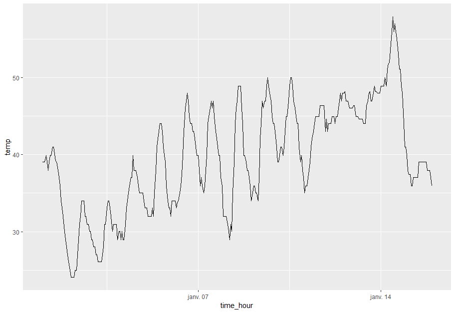

**Hint:** take a look at the [website this example was taken from](https://moderndive.com/3-viz.html).

**Answer:**
```
ggplot(early_january_weather, aes(x = time_hour, y = temp)) +
    geom_line()
```

**Success message:**
Good ! Now let's try something else:

**Question:** How would you do the same thing in blue ?

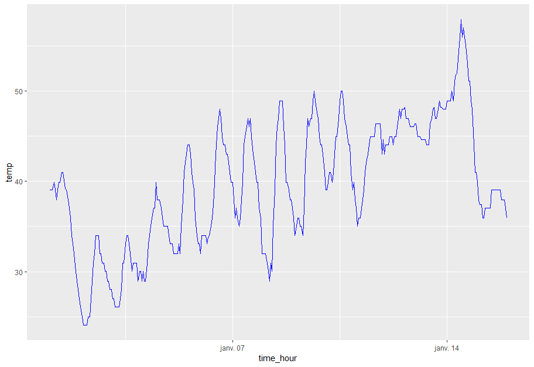

**Hint:** Try looking at ggplot's [documentation](http://ggplot.yhathq.com/docs/geom_line.html). In general, when you are stuck, the documentation is a good place to look for more information.

**Answer:**
```
ggplot(early_january_weather, aes(x = time_hour, y = temp)) +
    geom_line(colour = "blue")
```

**Success message:** You're getting better and better ! Let's make things a little more challenging:

**Question:** How would you plot the same information but indicate the humidity level (`humid` column) using transparency as show on the following image ?

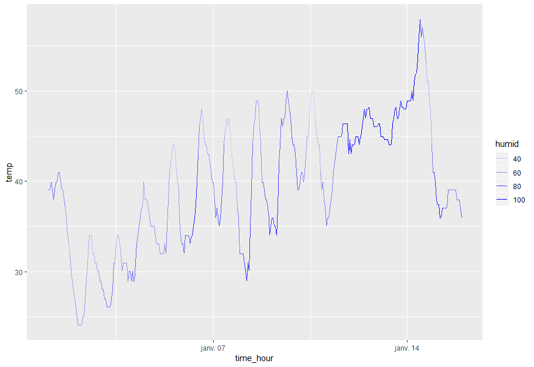

**Hint:** again, try looking at the [documentation](http://ggplot.yhathq.com/docs/geom_line.html). Try looking for the `alpha` parameter. How could you adjust it to produce the wanted plot ?

**Answer:**
```
ggplot(early_january_weather, aes(x = time_hour, y = temp, alpha = humid)) +
    geom_line(colour = "blue")
```

**Success message:** Excellent ! You're feeling comfortable with line charts !

### Question 2

Let's say you have the following data about the democracy score over time for four countries:

| year | Brazil | Guatemala | Panama | Switzerland |
|------|--------|-----------|--------|-------------|
| 1952 | 5      | 2         | -1     | 10          |
| 1957 | 5      | -6        | 4      | 10          |
| 1962 | 5      | -5        | 4      | 10          |
| 1967 | -9     | 3         | 4      | 10          |
| 1972 | -9     | 1         | -7     | 10          |
| 1977 | -4     | -3        | -7     | 10          |
| 1982 | -3     | -7        | -5     | 10          |
| 1987 | 7      | 3         | -8     | 10          |
| 1992 | 8      | 3         | 8      | 10          |

We would like to compare these 4 countries using 4 line charts:

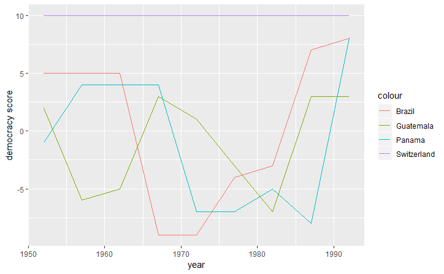

How would you do that ?

Select the correct code snippet:

1.
```
ggplot(spread_dem, aes(x = year, y = [Brazil, Guatemala, Panama, Switzerland])) +
    geom_line() +
    ylab("democracy score")
```

2.
```
ggplot(spread_dem, aes(year)) +
    geom_line(aes(y = Brazil)) +
    geom_line(aes(y = Guatemala)) +
    geom_line(aes(y = Panama)) +
    geom_line(aes(y = Switzerland)) +
    ylab("democracy score")
```


3.
```
ggplot(spread_dem, aes(year)) +
    geom_line(aes(y = Brazil, colour = "Brazil")) +
    geom_line(aes(y = Guatemala, colour = "Guatemala")) +
    geom_line(aes(y = Panama, colour = "Panama")) +
    geom_line(aes(y = Switzerland, colour = "Switzerland")) +
    ylab("democracy score")
```

4.
```
ggplot(spread_dem, aes(x = year, y0 = Brazil, y1 = Guatemala, y2 = Panama, y3 = Switzerland)) +
    geom_line() +
    ylab("democracy score")
```

**Hint:** Whenever there is something you are not sure how to do, you should try doing a quick Google search where you ask your question "How to plot multiple lines with ggplot". You should quickly find a [Stack Overflow solution](https://stackoverflow.com/questions/3777174/plotting-two-variables-as-lines-using-ggplot2-on-the-same-graph) where the question was already asked and answered. In general, websites such as Stack Overflow are a must for all serious programmers.

**Answer:** The right answer is the third one:
```
ggplot(spread_dem, aes(year)) +
    geom_line(aes(y = Brazil, colour = "Brazil")) +
    geom_line(aes(y = Guatemala, colour = "Guatemala")) +
    geom_line(aes(y = Panama, colour = "Panama")) +
    geom_line(aes(y = Switzerland, colour = "Switzerland")) +
    ylab("democracy score")
```
The first and last answers are wrong. The second one gives a plot but doesn't color it.

**Success message:** Congratulations, you have successfully answered all the line charts questions ! Now let's move on to the next plot type: histograms !

### Comment about the questions

The task description did not specify anything on the student's background except that they just learned the basics of the ggplot2 syntax. I assume that they do not have much prior experience with programming / data science so I came up with easy questions. However, if someone has already done programming / data science before (in Python for example), then it could be better to create more challenging questions.

**Time taken:** 15 min to come up with the questions, 1h15 to write them.

# Task 3

First we import the libraries we will use:


```python
%matplotlib inline
import numpy as np
import matplotlib.pyplot as plt
from sklearn.metrics import f1_score, recall_score, precision_score
from sklearn.model_selection import train_test_split
from sklearn.neighbors import KNeighborsClassifier
```

We create the method `get_samples` which will simply generate two classes of samples (with their labels):


```python
def get_samples(nb_features = 20, mean0 = 2, mean1 = 1.3, nb_samples0 = 2000, nb_samples1 = 2000):
    mean0_array = [mean0] * nb_features
    mean1_array = [mean1] * nb_features
    cov = np.identity(nb_features)
    samples0_features = np.random.multivariate_normal(mean0_array, cov, nb_samples0)
    samples1_features = np.random.multivariate_normal(mean1_array, cov, nb_samples1)
    
    labels0 = [0] * nb_samples0
    labels1 = [1] * nb_samples1
    return samples0_features, samples1_features, labels0, labels1
```

We create the method `get_train_test` which will generate the training and testing sets with their labels:


```python
def get_train_test(nb_features = 20, mean0 = 2, mean1 = 1.3, nb_samples0 = 2000, nb_samples1 = 2000):
    features0, features1, labels0, labels1 = get_samples(nb_features, mean0, mean1, nb_samples0, nb_samples1)
    features0_train, features0_test, labels0_train, labels0_test = train_test_split(features0, labels0, test_size = 0.3)
    features1_train, features1_test, labels1_train, labels1_test = train_test_split(features1, labels1, test_size = 0.3)
    
    X_train = np.append(features0_train, features1_train, axis=0)
    X_test = np.append(features0_test, features1_test, axis=0)
    y_train = labels0_train + labels1_train
    y_test = labels0_test + labels1_test
    
    return X_train, X_test, y_train, y_test
```


```python
X_train, X_test, y_train, y_test = get_train_test()
```

Now we create a function which takes the range of k values to test as argument and returns the model which achieved the best score, along with all the train and test scores:


```python
def get_scores(X_train, X_test, y_train, y_test, k_range = range(1, 200)):
    result_train = []
    result_test = []
    best_test_score = 0
    for k in k_range:
        if k % 100 == 0:
            print("k = {}".format(k))
        knn = KNeighborsClassifier(n_neighbors=k)
        knn.fit(X_train, y_train)
        train_score = knn.score(X_train, y_train)
        result_train.append(train_score)
        test_score = knn.score(X_test, y_test)
        result_test.append(test_score)
        
        if test_score > best_test_score:
            best_test_score = test_score
            best_model = knn
    return result_train, result_test, best_model
```

We train that model and test it for all values of k between 1 and 500 (inclusive)


```python
k_range = range(1, 500)
train_score, test_score, best_knn = get_scores(X_train, X_test, y_train, y_test, k_range)
```

    k = 100
    k = 200
    k = 300
    k = 400
    

We plot the test score depending on k:


```python
plt.plot(k_range, test_score)
```


    [<matplotlib.lines.Line2D at 0x1dbb8318e80>]


Discussion: we see that, roughly for the first 150 values of `k`, the test score is increasing but then it remains flat on average for all the values between 200 and 500. 

Possible approaches for finding the best values of `k` are more or less the same as for other classifiers. What I did is trying all values of `k` in a specific range. However, this can be computationally expensive when we have a lot of features/samples. Another famous approach is to use a logarithmic scale of values for `k`. For example:


```python
k_values = np.logspace(1, 3, dtype="int", num=30)
print(k_values)
```

    [  10   11   13   16   18   22   25   30   35   41   48   57   67   78   92
      108  126  148  174  204  239  280  329  385  452  529  621  727  853 1000]
    

Once we find the best values among those ones we can try to "look around it" to see if there is a better value.

Let's print the score metrics:


```python
predictions = best_knn.predict(X_test)
f1 = f1_score(predictions, y_test)
precision = precision_score(predictions, y_test)
recall = recall_score(predictions, y_test)
print("f1 score is {}".format(f1))
print("precision score is {}".format(precision))
print("recall score is {}".format(recall))
```

    f1 score is 0.9435215946843853
    precision score is 0.9466666666666667
    recall score is 0.9403973509933775
    

We see that the three values are very close to each other. This was expected because the number of samples was the same for both classes.

### Unbalanced samples case

Now let us try the second situation where we only have 100 samples in the second class:


```python
X_train, X_test, y_train, y_test = get_train_test(nb_samples1=100)
```

Let's train our model the same way we did before:


```python
result_train, result_test, best_knn_unbalanced = get_scores(X_train, X_test, y_train, y_test, k_range)
```

    k = 100
    k = 200
    k = 300
    k = 400
    


```python
plt.plot(k_range, result_test)
```


    [<matplotlib.lines.Line2D at 0x1dbb81c0828>]


This time the model seems to perform "better" for lower values of `k`. Once it has reached a threshold value then it flattens out completely ! Why is that ? Well, there are only 100 samples from class 1 and only 70 training samples. So at some point the classifier will just classify all points as class 0 points and always get an accuracy of 0.952 (`2000 / (2000 + 100)`).

The main issue here is that the classes are unbalanced. If there are two classes, one with 2000 samples and the other with 100 samples, then why not just output the first class each time ? This is almost exactly what the model does. It still performs a little better for smaller `k` values, where it manages to classify some class 1 points correctly since the number of neighbors is smaller.

Fortunately, accuracy is not the only metric for testing a model. Let's see what the other measures give:


```python
predictions = best_knn_unbalanced.predict(X_test)
f1 = f1_score(predictions, y_test)
precision = precision_score(predictions, y_test)
recall = recall_score(predictions, y_test)
print("f1 score is {}".format(f1))
print("precision score is {}".format(precision))
print("recall score is {}".format(recall))
```

    f1 score is 0.7083333333333334
    precision score is 0.5666666666666667
    recall score is 0.9444444444444444
    

We see that precision is quite low in fact. Precision and recall are two score measures whose purpose is to make sure we don't fall in the trap of thinking that our model is performing good while the classes are just unbalanced. For more detail you can look at the (sklearn documentation)[https://scikit-learn.org/stable/auto_examples/model_selection/plot_precision_recall.html].

**How to deal with this problem:** Well, there are several ways we could deal with this. One of them might be to simply copy the samples from the minority class until both classes have the same number of samples.

**Time taken:** 1h30

# Task 4: the Naive Bayse classifier

First of all, before talking about the classifier, let us refresh our high school maths memory. Let us suppose we have events A and B. A might be the event that it is sunny and B might be the event that it is hot. The Venn diagram for these events looks like this:

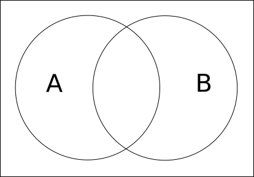

The situation where both events occur together, i.e. that it is both hot and sunny, is represented by the red section:

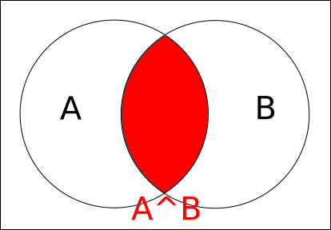

Now we want to see what P(B | A) is, i.e. the probably that event B occurs knowing A is true. What does it mean that A is true ? It means that our event is already somewhere in the A circle:

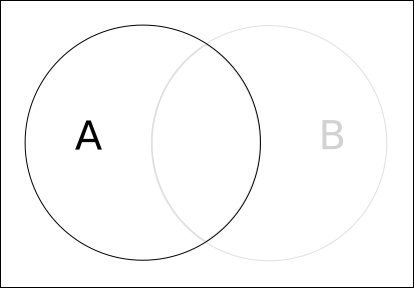

The probability that B still occurs when we know A is true is the surface of the intersection divided by the surface of the A circle:


So this will be:

```
P(B | A) = P(A, B) / P(A)
```

With the same steps for A we can conclude:

```
P(A | B) = P(A, B) / P(B)
```

If we multiply the first equation by `P(A)` and combine that with the second equation we get:

```
P(A | B) = (P(B | A) * P(A)) / P(B)
```

This is the most important formula for the Naive Bayes classifier. It is called **Bayes formula**.

Now let us say that you have a friend who likes running. You would like to predict whether or not she will go running today so you might offer her to do it together. Today is a sunny but cold day. The humidity is quite high and the wind is strong.

Let's say you have spied on her and have collected data about her: for the last two weeks you have written down whether or not she went running and you have also written down the weather for each day:

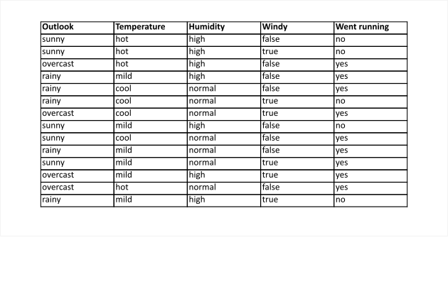

First of all we want to compute the overall probability that she is going to run today. To do this simply divide the number of times she went running by the number of days in the last 2 weeks:

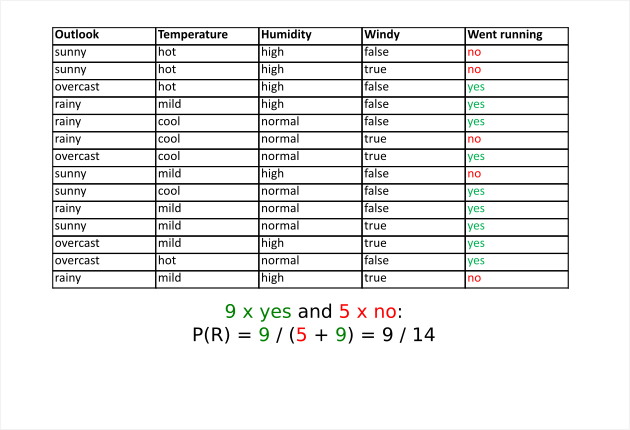

We want to compute the probability that it is sunny given that she went running. Why do we want to do that ? We'll see later.

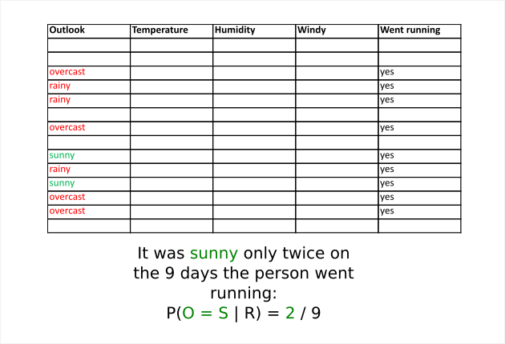

O = S is an abbreviation for the event "Outlook = Sunny". We also want the probability that it was sunny given she didn't go running:

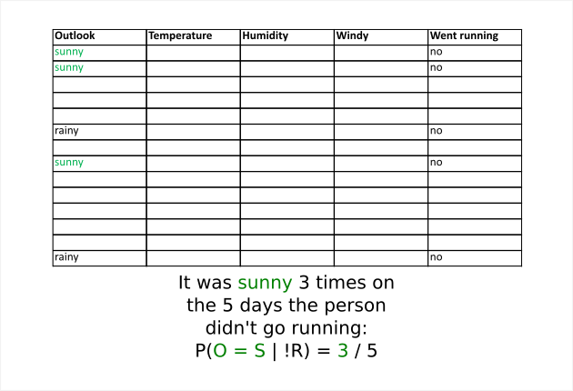

We can continue like that for the three other features: temperature, humidity and windy. Let's call them T, H and W respectively. For example T = C is an abbreviation for the event "Temperature = cool". The final results are:

```
P(O = S | R) = 2 / 9
P(T = C | R) = 3 / 9
P(H = H | R) = 3 / 9
P(W = T | R) = 3 / 9

P(O = S | !R) = 3 / 5
P(T = C | !R) = 1 / 5
P(H = H | !R) = 4 / 5
P(W = T | !R) = 3 / 5
```

We have "today's event": it is sunny, the temperature is cool, the humidity is high and the wind is strong. Let's call this event `D`. We have

```
D = "O = S, T = C, H = H, W = T"
```

We assume that all the variables are independent (reason why it is called **Naive** Bayes). We have:

```
P(D | R) = P(O = S | R) * P(T = C | R) * P(H = H | R) * P(W = T | R) =
(2 / 9) * (3 / 9) * (3 / 9) * (3 / 9) =
0.0082

P(D | !R) = P(O = S | !R) * P(T = C | !R) * P(H = H | !R) * P(W = T | !R) =
(3 / 5) * (1 / 5) * (4 / 5) * (3 / 5) =
0.0576
```

Now we can come back to our Bayes formula and compute the probability that our friend goes running today:

```
P(R | D) = (P(D | R) * P(R)) / P(D) =
(0.0082 * 9 / 14) / P(D) =
0.0053 / P(D)
```

In the same manner we can also compute the probability that she doesn't go running:

```
P(!R | D) = (P(D | !R) * p(!R)) / P(D) =
(0.0576 * 5 / 14) / P(D) =
0.0206 / P(D)
```

Let us look at what we have here. We have concluded that the probability that our friend goes running today is `0.0053 / P(D)` and the probability that she doesn't go is `0.021 / P(D)`. Probably you noticed that our answer is incomplete since there is still the `P(D)`. However, the second probability is clearly higher than the first since it is the same factor in both. So we have our prediction: Knowing that it is sunny, the temperature is cool, humidity high and windy our friend will probably not go running !

**Question 1:**
Now let us suppose the outlook is rainy, temperature cool, humidity high and there is no wind. What is the probability that our friend goes running ?

**Comment:** I would ask several questions like this one because practice is the most important when learning these concepts, even if you do the same type of exercise many times.

**Question 2:**
Remember the `P(D)` factor in our final answer above ? How would you compute it ?

**General comment:** For the dataset I got inspiration from a [Youtube video](https://youtu.be/CPqOCI0ahss).

**Time taken:** 2h15. Indeed I took some time to choose how I will present the material.


# Task 5: the F1 score

### Warm up: computing the score for a classification model

How do you measure the performance of a classification model such as logistic regression ? An easy answer is to simply take our test set, predict the label for each element in the test set and compare it with the true label. The accuracy score of the model is simply the ratio of correct predictions. For example, if the model predicts correctly 90% of the time, then the accuracy score is `0.9`.

To give a better illustration of this we can suppose we trained a model for recognizing cats and dogs on images. Then we tested that model on 200 images (100 cats and 100 dogs) and got the following results:

|             | Predicted: cat | Predicted: dog |
|-------------|----------------|----------------|
| Actual: cat | 91             | 9              |
| Actual: dog | 11             | 89             |

Among the 100 cats, 91 were correctly classified but 9 were misclassified as dogs. In the same way, among the 100 dogs, 89 were correctly classified as dogs but 11 were misclassified as cats. To compute the accuracy we can simple take all the correctly classified images (`91 + 89 = 180`) and divide this number by the total number of images (`200`) and we get `180 / 200 = 0.9`. So our model's accuracy score is `0.9` !

Now let's choose another example: let's suppose we have created a model for predicting whether a person has cancer or not depending on a radio image of her lungs. Let's say we trained our model in a very lazy and dangerous way: we just make it predict that the person doesn't have cancer, no matter the image. That model is really bad anyway. It will probably achieve a score of `0.5` since it is just stupid deterministic guessing. Now let's suppose we have our test data: 200 images, where 5 represent sick lungs. This is what our model achieved:

|                   | Predicted: cancer | Predicted: no cancer |
|-------------------|-------------------|----------------------|
| Actual: cancer    | 0                 | 5                    |
| Actual: no cancer | 0                 | 195                  |

Now let's compute the score: as before we take the number of correctly classified images (`0 + 195`) and divide it by the number of total images (`200`) and we obtain `195 / 200 = 0.975`. Wait what ?! How is this possible ? There must be a miscalculation somewhere ! This model is even better than the cat/dog classifier !

Actually, truth is that accuracy is not the right score metric for this case. In general, in situations where the classes are unbalanced (5 cancer vs 195 non cancer), we should avoid relying on accuracy. But how will we compute the performance of our model then ? Fortunately, there are other metrics available we can rely on.

### Recall and Precision

**Confusion matrix:** First of all let's generalize the matrices we saw above. In a general yes/no classification task the following matrice is called the **confusion matrix**. 

|             | Predicted: yes | Predicted: no  |
|-------------|----------------|----------------|
| Actual: yes | True Positive  | False Negative |
| Actual: no  | False Positive | True Negative  |

The true positives are the samples that were correctly classified as "yes". In the cancer example, there were 0 true positives (TP), 0 false positives (FP), 5 false negatives (FN) and 195 true negatives (TN).

We define the **recall score** of the model as the number of true positives divided by the total number of actual "yes" samples or:

`Recall = TP / (TP + FN)`

We also define the **precision score** of the model as the number of true positives divided by the total number of predicted "yes" samples or:

`Precision = TP / (TP + FP)`

The recall for our cancer detection model is `0 / (0 + 5) = 0`. This is it ! While the accuracy score was very high, the recall is `0` and this is telling us that there is something wrong with our model. Think of the recall as the ability of a model to identify all relevant cases, for example to correctly identify cancer regardless of the number of non cancer cases.

The precision will be `0 / (0 + 0) = 0 / 0` so there is no point in computing it like this. Let's say the model correctly identified only one case of cancer:

|                   | Predicted: cancer | Predicted: no cancer |
|-------------------|-------------------|----------------------|
| Actual: cancer    | 1                 | 4                    |
| Actual: no cancer | 0                 | 195                  |

The precision is then `1 / 1 + 0 = 1`. Unfortunately, even though only one case out of 5 was correctly identified as cancer, the model still achieved a precision score of `1.0`. However let us try another bad model: let's suppose that our model has correctly classified all our cancer patients as having cancer, which is good. However, it also classified 15 healthy patients as having cancer.

|                   | Predicted: cancer | Predicted: no cancer |
|-------------------|-------------------|----------------------|
| Actual: cancer    | 5                 | 0                    |
| Actual: no cancer | 15                | 180                  |

The accuracy is `(5 + 180) / 200 = 0.925` and the recall is `5 / (5 + 0) = 1.0`. However, the precision is `5 / (5 + 15) = 0.25` ! Think of precision as the ability of the model to return only relevant instances.

There are situations where we do not mind if the recall score is lower and there are others where the precision score is not that important. Choosing the right score metric is not always straightforward and requires careful thinking about the nature of the task at hand.

In general, if we want a good model for all situations, we want to verify that precision and recall scores are both high.

### The F1 score
Ideally, we would like to be sure that our model has a good score in both precision and recall aspect. For this we can simply compute the arithmetic mean of the two values: `precision + recall / 2`. So if one of the two is 0 and the other is 1, then the mean will be `0.5`. However, we would like to go further and completely penalize low precision or recall. Ideally, if one of the 2 is `0` then we would like the final score to be `0`. For this we can use the **F1 score** which is simply the harmonic mean of the precision and the recall:

`F1 score = 2 * (recall * precision) / (recall + precision)`

Now we can try: if one of the two is `0` and the other is `1` then the final score is `2 * (1 * 0) / (1 + 0) = 0`. This way we can protect ourself from falling into the "accuracy trap".

### Scikit learn example

We will now show an example in Python with the sklearn library. We will have two classes where the samples are generated according to a multivariate Gaussian distribution. The first class will be generated with mean `2` and the second class with mean `1.3` (Comment: the same dataset as in task 3)


```python
%matplotlib inline
import numpy as np
import matplotlib.pyplot as plt
from sklearn.linear_model import LogisticRegression
from sklearn.metrics import f1_score, recall_score, precision_score
from sklearn.model_selection import train_test_split

def get_samples(nb_features = 20, mean0 = 2, mean1 = 1.3, nb_samples0 = 2000, nb_samples1 = 2000):
    mean0_array = [mean0] * nb_features
    mean1_array = [mean1] * nb_features
    cov = np.identity(nb_features)
    samples0_features = np.random.multivariate_normal(mean0_array, cov, nb_samples0)
    samples1_features = np.random.multivariate_normal(mean1_array, cov, nb_samples1)
    
    labels0 = [0] * nb_samples0
    labels1 = [1] * nb_samples1
    return samples0_features, samples1_features, labels0, labels1

def get_train_test(nb_features = 20, mean0 = 2, mean1 = 1.3, nb_samples0 = 2000, nb_samples1 = 2000):
    features0, features1, labels0, labels1 = get_samples(nb_features, mean0, mean1, nb_samples0, nb_samples1)
    features0_train, features0_test, labels0_train, labels0_test = train_test_split(features0, labels0, test_size = 0.3)
    features1_train, features1_test, labels1_train, labels1_test = train_test_split(features1, labels1, test_size = 0.3)
    
    X_train = np.append(features0_train, features1_train, axis=0)
    X_test = np.append(features0_test, features1_test, axis=0)
    y_train = labels0_train + labels1_train
    y_test = labels0_test + labels1_test
    
    return X_train, X_test, y_train, y_test
```

First we have the balanced dataset where both classes have 2000 samples. We use simple logistic regression without any parameter tuning:


```python
X_train, X_test, y_train, y_test = get_train_test()
lg = LogisticRegression()
lg.fit(X_train, y_train)
```


    LogisticRegression(C=1.0, class_weight=None, dual=False, fit_intercept=True,
              intercept_scaling=1, max_iter=100, multi_class='ovr', n_jobs=1,
              penalty='l2', random_state=None, solver='liblinear', tol=0.0001,
              verbose=0, warm_start=False)


Now let's compute the three score values:


```python
predictions = lg.predict(X_test)
f1 = f1_score(predictions, y_test)
precision = precision_score(predictions, y_test)
recall = recall_score(predictions, y_test)
print("F1 score is {0:.3f}".format(f1))
print("Precision score is {0:.3f}".format(precision))
print("Recall score is {0:.3f}".format(recall))
```

    F1 score is 0.591
    Precision score is 0.433
    Recall score is 0.929
    

The three score are quite good, which was expected since the dataset was balanced. Now let's try with an unbalanced dataset where class 0 has 2000 samples but class 1 has only 100 samples:


```python
X_train, X_test, y_train, y_test = get_train_test(nb_samples1=100)
lg = LogisticRegression()
lg.fit(X_train, y_train)
```


    LogisticRegression(C=1.0, class_weight=None, dual=False, fit_intercept=True,
              intercept_scaling=1, max_iter=100, multi_class='ovr', n_jobs=1,
              penalty='l2', random_state=None, solver='liblinear', tol=0.0001,
              verbose=0, warm_start=False)


```python
predictions = lg.predict(X_test)
f1 = f1_score(predictions, y_test)
precision = precision_score(predictions, y_test)
recall = recall_score(predictions, y_test)
print("F1 score is {0:.3f}".format(f1))
print("Precision score is {0:.3f}".format(precision))
print("Recall score is {0:.3f}".format(recall))
```

    F1 score is 0.591
    Precision score is 0.433
    Recall score is 0.929
    

Here we obtained a good recall but a very low precision score (and hence a low F1 score), which was expected since there were only 100 samples in the second class.

**Time taken:** 2h

# Task 6

In general, and especially if your data is numerical, then it is a good idea to do it. You can still use non-normalized data but normalizing it makes life easier.

One common reason is feature scaling. Imagine that you trained your model on a dataset with two features `x` and `y` and your model somehow decided that the best prediction formula is `x^4 + y`. Now imagine you have the following dataset:

| x     | y   |
|-------|-----|
| 200   | 400 |
| 21000 | 100 |
| 400   | 450 |

Now if the model tries to predict the right label for those values it will compute:

```
v0 = 200^4 + 400 = 1600000400
v1 = 21000^4 + 100 = 194481000000000100
v2 = 400^4 + 450 = 25600000450
```

As you can see the computations can easily "explode" depending on the model and the scaling of the values. This is why it is so important to normalize data and to keep them in a form where explosions like this won't happen.

There are some other reasons like:
1. Consistency: we would like models and dataset to be easily comparable. So it is much better if all of them are normalized.
2. Machine learning optimizations, like the ones in the scikit learn library, work much better when the dataset is normalized.
3. Regularization behaves differently for different scaling. It will work better with normalized data.

Min max scaling consists in normalizing the data so that the minimum instance has value 0 and the maximum instance has value 1 while zero mean/unit variance normalization consists in normalizing the data so that the mean is 0 and the variance is 1. Zero mean/unit variance normalization is most commonly used but choosing one of the two really depends on the task at hand. Try going choosing zero mean/unit variance "by default" but be careful about the situation: if you have an image where pixels have values 0-255, then scaling them to 0-1 is probably better. Or, if you're using neural networks, it is likely that they work better on data that lies in the 0-1 range.

**Time taken:** Approximately 25 min

# Task 7

### Static:

##### Advantages:
* Most effective for simple data (few variables and not too much data)
* Cheap to build
* Standardized ways of building them: There are already a few standard static visualization plot types that everybody is familiar with (line charts, scatter plots, histograms, etc.)
* Can be printed

##### Disadvantages:
* Sometimes isn't enough for visualizing complex data
* Depending on the audience, it can be "boring" in less serious settings
* Difficult to show the big picture and the details at the same time
* Difficult to get insights from your audience
* Data must be updated manually if it changes

### Interactive

##### Advantages:
* Possibility to show complex data
* The user has total control on what she wants to show, you can involve your audience more
* More efficient at captivating user's attention (if done right)
* Allows showing the big picture and the details at the same time
* Allows to get insights from your audience (for example you can track clicks to see what data gets the most attention)
* Data can be updated in real time

##### Disadvantages:
* Often it can be difficult to understand how the visualization works
* Often it can be more than necessary
* Expensive to build
* No standardized way of building them
* Cannot be printed

### Animated

##### Advantages:
* Like interactive, it allows us to show complex data
* Allows guiding the audience through what we want to show them
* More efficient at captivating user's attention (if done right)
* Allows showing the big picture and the details (at least some of them) at the same time

##### Disadvantages:

* Like interactive, expensive to build
* Often it can be more than necessary
* The viewer doesn't have control
* No standardized way of building them
* Difficult to get insights from your audience

**Time taken:** 30 min
