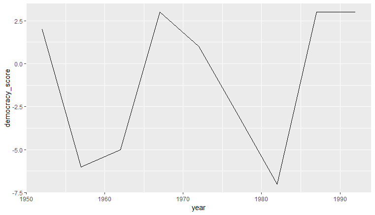

# Task 1, question 2

Hi,

thank you for your question. I am sorry our explanations weren't clear enough. I should have focused more on the purpose of the `gather` function.

Often the data we have at disposal is not in the right "shape" for what we would like to do with it. Here is an example. Let's say you have the following data:

| country     | 1952 | 1957 | 1962 | 1967 | 1972 | 1977 | 1982 | 1987 | 1992 |
|-------------|------|------|------|------|------|------|------|------|------|
| France      | 10   | 10   | 5    | 5    | 8    | 8    | 8    | 9    | 9    |
| Georgia     | -9   | -7   | -7   | -7   | -7   | -7   | -7   | -7   | 4    |
| Germany     | 10   | 10   | 10   | 10   | 10   | 10   | 10   | 10   | 10   |
| Greece      | 4    | 4    | 4    | -7   | -7   | 8    | 8    | 10   | 10   |
| Guatemala   | 2    | -6   | -5   | 3    | 1    | -3   | -7   | 3    | 3    |
| Haiti       | -5   | -5   | -9   | -9   | -10  | -9   | -9   | -8   | -7   |
| Honduras    | -3   | -1   | -1   | -1   | -1   | -1   | 6    | 5    | 6    |

This data represents the level of "democracy" over time for different countries. Now let's say we want to plot Guatemala's level of democracy over time on a line chart. First let's filter Guatemala from the data:

```
guat_dem <- dem_score %>%
+ filter(country == "Guatemala")
```

Now we have the following table:

| country     | 1952 | 1957 | 1962 | 1967 | 1972 | 1977 | 1982 | 1987 | 1992 |
|-------------|------|------|------|------|------|------|------|------|------|
| Guatemala   | 2    | -6   | -5   | 3    | 1    | -3   | -7   | 3    | 3    |

Now I want to plot the democracy level over time on a line chart like this:



However, it is hard to do that when I don't have a year variable that I could define as the x axis ! I only have the years as column names. Now, by using the `gather` function, I can reshape my data into a much better form:

```
guat_tidy <- gather(data = guat_dem, key = year, value = democracy_score, - country)
```

Now our data looks like this:

| country   | year | democracy_score |
|-----------|------|-----------------|
| Guatemala | 1952 | 2               |
| Guatemala | 1957 | -6              |
| Guatemala | 1962 | -5              |
| Guatemala | 1967 | 3               |
| Guatemala | 1972 | 1               |
| Guatemala | 1977 | -3              |
| Guatemala | 1982 | -7              |
| Guatemala | 1987 | 3               |
| Guatemala | 1992 | 3               |

I have a `year` and a `democracy_score` variable and I can easily use them for the x and the y axis of my graph. I simply do:

```
ggplot(data = guat_tidy, mapping = aes(x = parse_number(year), y = democracy_score)) +
  geom_line() +
  labs(x = "year")
```

Don't be confused by the `parse_number` function. When we created our year column the computer interpreted the year names as strings so we converted them using the `parse_number` function.

I took this example from [here](https://moderndive.com/4-tidy.html) if you want more detail. Do not hesitate to write me back for further explanations if something is not clear !

Time taken: 15 minutes to find a good example and maybe 30 min to write it in Markdown.
