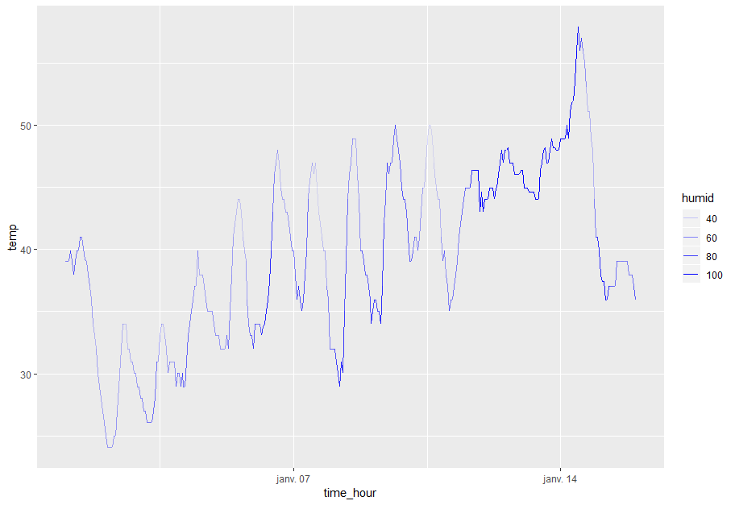

# Task 2

### Question 1

You have the weather data for the 2013 year in the `weather` tibble that you can get from the `nycflights13` package. After installing that package (R command or R Studio interface) you can do:

```
library(nycflights13)
```

Now you can access the `weather` variable which contains the information about the weather for each airport in the 2013 year. We will focus only on the EWR airport and the first fifteen days in january:

```
early_january_weather <- weather %>%
    filter(origin == "EWR" & month == 1 & day <= 15)
```

The data looks like this:

| origin | year | month | day | hour | temp  | dewp  | humid | wind_dir | wind_speed | wind_gust | precip | pressure | visib | time_hour  |
|--------|------|-------|-----|------|-------|-------|-------|----------|------------|-----------|--------|----------|-------|------------|
| EWR    | 2013 | 1     | 1   | 1    | 39.02 | 26.06 | 59.37 | 270      | 10.35702   | NA        | 0      | 1012     | 10    | 2013-01-01 01:00:00 |
| EWR    | 2013 | 1     | 1   | 2    | 39.02 | 26.96 | 61.63 | 250      | 8.05546    | NA        | 0      | 1012.3   | 10    | 2013-01-01 02:00:00 |
| EWR    | 2013 | 1     | 1   | 3    | 39.02 | 28.04 | 64.43 | 240      | 11.5078    | NA        | 0      | 1012.5   | 10    | 2013-01-01 03:00:00 |
| EWR    | 2013 | 1     | 1   | 4    | 39.92 | 28.04 | 62.21 | 250      | 12.65858   | NA        | 0      | 1012.2   | 10    | 2013-01-01 04:00:00 |
| EWR    | 2013 | 1     | 1   | 5    | 39.02 | 28.04 | 64.43 | 260      | 12.65858   | NA        | 0      | 1011.9   | 10    | 2013-01-01 05:00:00 |
| EWR    | 2013 | 1     | 1   | 6    | 37.94 | 28.04 | 67.21 | 240      | 11.5078    | NA        | 0      | 1012.4   | 10    | 2013-01-01 06:00:00 |
| EWR    | 2013 | 1     | 1   | 7    | 39.02 | 28.04 | 64.43 | 240      | 14.96014   | NA        | 0      | 1012.2   | 10    | 2013-01-01 07:00:00 |
| EWR    | 2013 | 1     | 1   | 8    | 39.92 | 28.04 | 62.21 | 250      | 10.35702   | NA        | 0      | 1012.2   | 10    | 2013-01-01 08:00:00 |
| EWR    | 2013 | 1     | 1   | 9    | 39.92 | 28.04 | 62.21 | 260      | 14.96014   | NA        | 0      | 1012.7   | 10    | 2013-01-01 09:00:00 |
| EWR    | 2013 | 1     | 1   | 10   | 41    | 28.04 | 59.65 | 260      | 13.80936   | NA        | 0      | 1012.4   | 10    | 2013-01-01 10:00:00 |

**Question:** How would you plot a line chart where you show the temperature (`temp` column) depending on the time (`time_hour` column) ? The final result is shown on the following image:


**Hint:** take a look at the [website this example was taken from](https://moderndive.com/3-viz.html).

**Answer:**
```
ggplot(early_january_weather, aes(x = time_hour, y = temp)) +
    geom_line()
```

**Success message:**
Good ! Now let's try something else:

**Question:** How would you do the same thing in blue ?


**Hint:** Try looking at ggplot's [documentation](http://ggplot.yhathq.com/docs/geom_line.html). In general, when you are stuck, the documentation is a good place to look for more information.

**Answer:**
```
ggplot(early_january_weather, aes(x = time_hour, y = temp)) +
    geom_line(colour = "blue")
```

**Success message:** You're getting better and better ! Let's make things a little more challenging:

**Question:** How would you plot the same information but indicate the humidity level (`humid` column) using transparency as show on the following image ?



**Hint:** again, try looking at the [documentation](http://ggplot.yhathq.com/docs/geom_line.html). Try looking for the `alpha` parameter. How could you adjust it to produce the wanted plot ?

**Answer:**
```
ggplot(early_january_weather, aes(x = time_hour, y = temp, alpha = humid)) +
    geom_line(colour = "blue")
```

**Success message:** Excellent ! You're feeling comfortable with line charts !

### Question 2

Let's say you have the following data about the democracy score over time for four countries:

| year | Brazil | Guatemala | Panama | Switzerland |
|------|--------|-----------|--------|-------------|
| 1952 | 5      | 2         | -1     | 10          |
| 1957 | 5      | -6        | 4      | 10          |
| 1962 | 5      | -5        | 4      | 10          |
| 1967 | -9     | 3         | 4      | 10          |
| 1972 | -9     | 1         | -7     | 10          |
| 1977 | -4     | -3        | -7     | 10          |
| 1982 | -3     | -7        | -5     | 10          |
| 1987 | 7      | 3         | -8     | 10          |
| 1992 | 8      | 3         | 8      | 10          |

We would like to compare these 4 countries using 4 line charts:


How would you do that ?

Select the correct code snippet:

1.
```
ggplot(spread_dem, aes(x = year, y = [Brazil, Guatemala, Panama, Switzerland])) +
    geom_line() +
    ylab("democracy score")
```

2.
```
ggplot(spread_dem, aes(year)) +
    geom_line(aes(y = Brazil)) +
    geom_line(aes(y = Guatemala)) +
    geom_line(aes(y = Panama)) +
    geom_line(aes(y = Switzerland)) +
    ylab("democracy score")
```


3.
```
ggplot(spread_dem, aes(year)) +
    geom_line(aes(y = Brazil, colour = "Brazil")) +
    geom_line(aes(y = Guatemala, colour = "Guatemala")) +
    geom_line(aes(y = Panama, colour = "Panama")) +
    geom_line(aes(y = Switzerland, colour = "Switzerland")) +
    ylab("democracy score")
```

4.
```
ggplot(spread_dem, aes(x = year, y0 = Brazil, y1 = Guatemala, y2 = Panama, y3 = Switzerland)) +
    geom_line() +
    ylab("democracy score")
```

**Hint:** Whenever there is something you are not sure how to do, you should try doing a quick Google search where you ask your question "How to plot multiple lines with ggplot". You should quickly find a [Stack Overflow solution](https://stackoverflow.com/questions/3777174/plotting-two-variables-as-lines-using-ggplot2-on-the-same-graph) where the question was already asked and answered. In general, websites such as Stack Overflow are a must for all serious programmers.

**Answer:** The right answer is the third one:
```
ggplot(spread_dem, aes(year)) +
    geom_line(aes(y = Brazil, colour = "Brazil")) +
    geom_line(aes(y = Guatemala, colour = "Guatemala")) +
    geom_line(aes(y = Panama, colour = "Panama")) +
    geom_line(aes(y = Switzerland, colour = "Switzerland")) +
    ylab("democracy score")
```
The first and last answers are wrong. The second one gives a plot but doesn't color it.

**Success message:** Congratulations, you have successfully answered all the line charts questions ! Now let's move on to the next plot type: histograms !

### Comment about the questions

The task description did not specify anything on the student's background except that they just learned the basics of the ggplot2 syntax. I assume that they do not have much prior experience with programming / data science so I came up with easy questions. However, if someone has already done programming / data science before (in Python for example), then it could be better to create more challenging questions.

### Time taken
15 min to come up with the questions, 1h15 to write them.
