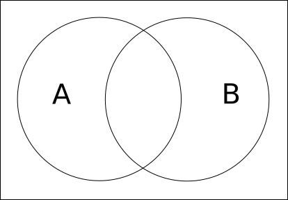
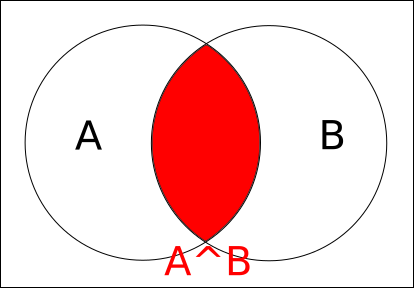
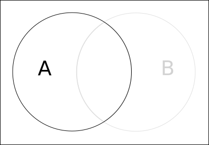
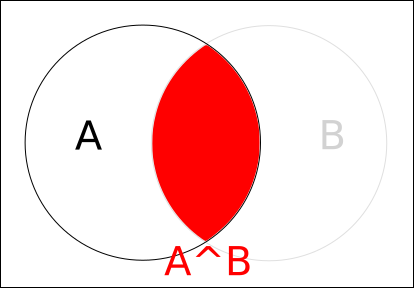
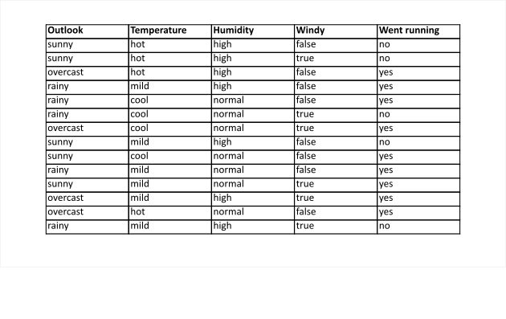
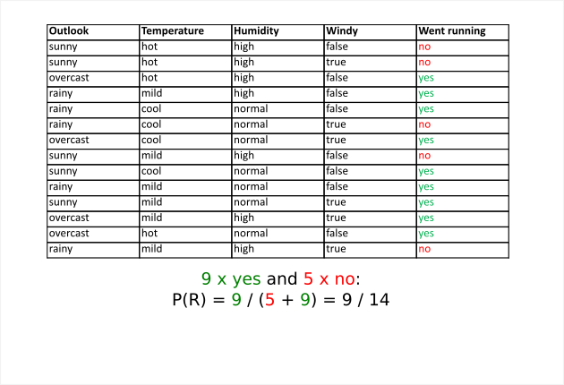
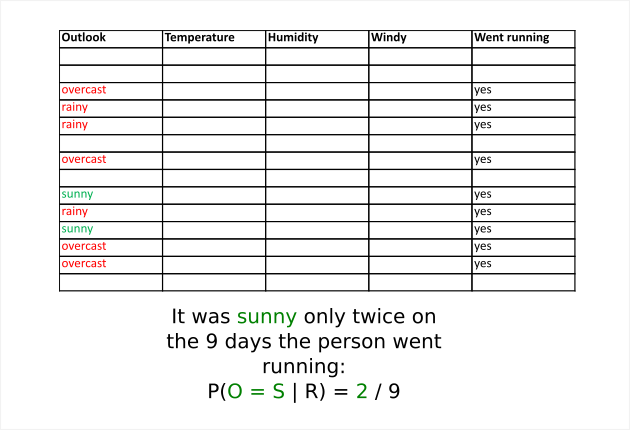
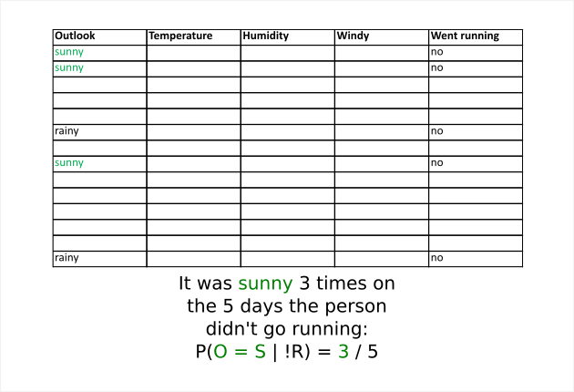

# Task 4: the Naive Bayse classifier

First of all, before talking about the classifier, let us refresh our high school maths memory. Let us suppose we have events A and B. A might be the event that it is sunny and B might be the event that it is hot. The Venn diagram for these events looks like this:



The situation where both events occur together, i.e. that it is both hot and sunny, is represented by the red section:



Now we want to see what P(B | A) is, i.e. the probably that event B occurs knowing A is true. What does it mean that A is true ? It means that our event is already somewhere in the A circle:



The probability that B still occurs when we know A is true is the surface of the intersection divided by the surface of the A circle:



So this will be:

```
P(B | A) = P(A, B) / P(A)
```

With the same steps for A we can conclude:

```
P(A | B) = P(A, B) / P(B)
```

If we multiply the first equation by `P(A)` and combine that with the second equation we get:

```
P(A | B) = (P(B | A) * P(A)) / P(B)
```

This is the most important formula for the Naive Bayes classifier. It is called **Bayes formula**.

Now let us say that you have a friend who likes running. You would like to predict whether or not she will go running today so you might offer her to do it together. Today is a sunny but cold day. The humidity is quite high and the wind is strong.

Let's say you have spied on her and have collected data about her: for the last two weeks you have written down whether or not she went running and you have also written down the weather for each day:



First of all we want to compute the overall probability that she is going to run today. To do this simply divide the number of times she went running by the number of days in the last 2 weeks:



We want to compute the probability that it is sunny given that she went running. Why do we want to do that ? We'll see later.



O = S is an abbreviation for the event "Outlook = Sunny". We also want the probability that it was sunny given she didn't go running:



We can continue like that for the three other features: temperature, humidity and windy. Let's call them T, H and W respectively. For example T = C is an abbreviation for the event "Temperature = cool". The final results are:

```
P(O = S | R) = 2 / 9
P(T = C | R) = 3 / 9
P(H = H | R) = 3 / 9
P(W = T | R) = 3 / 9

P(O = S | !R) = 3 / 5
P(T = C | !R) = 1 / 5
P(H = H | !R) = 4 / 5
P(W = T | !R) = 3 / 5
```

We have "today's event": it is sunny, the temperature is cool, the humidity is high and the wind is strong. Let's call this event `D`. We have

```
D = "O = S, T = C, H = H, W = T"
```

We assume that all the variables are independent (reason why it is called **Naive** Bayes). We have:

```
P(D | R) = P(O = S | R) * P(T = C | R) * P(H = H | R) * P(W = T | R) =
(2 / 9) * (3 / 9) * (3 / 9) * (3 / 9) =
0.0082

P(D | !R) = P(O = S | !R) * P(T = C | !R) * P(H = H | !R) * P(W = T | !R) =
(3 / 5) * (1 / 5) * (4 / 5) * (3 / 5) =
0.0576
```

Now we can come back to our Bayes formula and compute the probability that our friend goes running today:

```
P(R | D) = (P(D | R) * P(R)) / P(D) =
(0.0082 * 9 / 14) / P(D) =
0.0053 / P(D)
```

In the same manner we can also compute the probability that she doesn't go running:

```
P(!R | D) = (P(D | !R) * p(!R)) / P(D) =
(0.0576 * 5 / 14) / P(D) =
0.0206 / P(D)
```

Let us look at what we have here. We have concluded that the probability that our friend goes running today is `0.0053 / P(D)` and the probability that she doesn't go is `0.021 / P(D)`. Probably you noticed that our answer is incomplete since there is still the `P(D)`. However, the second probability is clearly higher than the first since it is the same factor in both. So we have our prediction: Knowing that it is sunny, the temperature is cool, humidity high and windy our friend will probably not go running !

**Question 1:**
Now let us suppose the outlook is rainy, temperature cool, humidity high and there is no wind. What is the probability that our friend goes running ?

**Comment:** I would ask several questions like this one because practice is the most important when learning these concepts, even if you do the same type of exercise many times.

**Question 2:**
Remember the `P(D)` factor in our final answer above ? How would you compute it ?

**General comment:** For the dataset I got inspiration from a [Youtube video](https://youtu.be/CPqOCI0ahss).

**Time I took:** 2h15. Indeed I took some time to choose how I will present the material.
